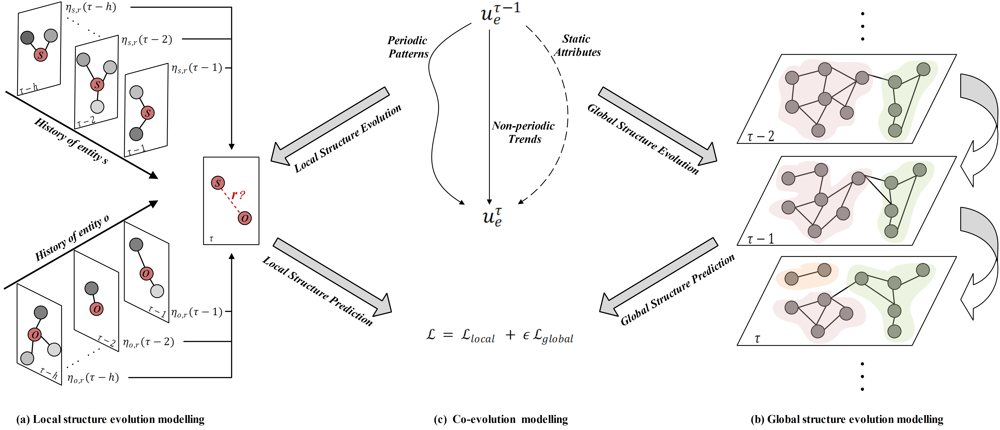

# pytorch implementation of EvoExplore

Paper: "EvoExplore: temporal knowledge graph representation learning via co-evolution modelling"

In this paper, we propose a novel framework to learn representations for temporal knowledge graph via modelling its local and global structure co-evolution, and this repository contains the  benchmark datasets used in the paper and the implementation of our proposed framework.

<p align="center"></p>

We firstly regard the local structure evolution as the establishment process of relations between different entities, and propose a novel hierarchical-attention-based temporal point process to model the establishment of each relation. This helps our framework to capture the evolutionary nature of TKG from a local perspective. Secondly, we regard the global structure evolution as its time-evolving community partition, and design a soft modularity as the metric to model the community structure in TKG. By jointly maximizing the soft modularity in each timestamp, our framework captures the evolutionary nature of TKG from a global perspective. Finally, we employ a multi-task loss function to jointly optimize the above two parts, which allows EvoExplore to capture the co-evolutionary pattern between local and global structure evolutions. Experimental results demonstrate the superiority of our proposed method compared with existing baselines.

If you make use of this code in your work, please cite the following paper:

```
@inproceedings{Zhang2020TKGFrame,
  title={A Two-Phase Framework for Temporal-Aware Knowledge Graph Completion},
  author={Jiasheng Zhang, Yongpan Sheng and Jie Shao},
  booktitle={the 4th Asia Pacific Web and Web-Age Information ManagementJoint Conference on Web and Big Data},
  year={2020}
}
```

## Contents
1. [Installation](#installation)
2. [Train_and_Test](#Train_and_Test)
3. [Datasets](#Datasets)
4. [Baselines](#Baselines)
5. [Contact](#contact)

## Installation

Install the following packages:

```
pip install torch
pip install numpy
```

Install CUDA and cudnn. Then run:

```
pip install cutorch
pip install cunn
pip install cudnn
```

Then clone the repository::

```
git clone https://github.com/zjs123/TKGComplt.git
```

We use Python3 for data processing and our code is also written in Python3. 

## Train_and_Test

Before running, the user should process the datasets at first
```
cd datasets/DATA_NAME
python data_processing.py
```
Then, Train the model
```
cd ..
python Train.py 
```
Finally, ILP model was used to predict new facts
```
python ILP_solver.py
```
The default hyperparameters give the best performances.

## Datasets

There are three datasets used in our experiment:YAGO11K, WIKIDATA12K and WIKIDATA36K. facts of each datases have time annotation, which is formed as "[start_time , end_time]". Each data folder has six files: 

-entity2id.txt: the first column is entity name, and second column is index of entity.

-relation2id.txt:the first column is relation name, and second column is index of relation.

-train.txt , test.txt , valid.txt: the first column is index of subject entity, second column is index of relation, third column is index of object entity, fourth column is the start time of fact and fifth column is end time of fact.

-stat.txt: num of entites and num of relations

## Baselines

We use following public codes for baseline experiments. 

| Baselines   | Code                                                                      | Embedding size | Batch num |
|-------------|---------------------------------------------------------------------------|----------------|------------|
| TransE ([Bordes et al., 2013](https://papers.nips.cc/paper/5071-translating-embeddings-for-modeling-multi-relational-data))      | [Link](https://github.com/thunlp/OpenKE/tree/OpenKE-PyTorch/openke) | 100, 200       | 100, 200       |
| TransH ([Wang et al., 2014](https://www.aaai.org/ocs/index.php/AAAI/AAAI14/paper/view/8531/8546))   | [Link](https://github.com/thunlp/OpenKE/tree/OpenKE-PyTorch/openke) | 100, 200       | 100, 200      |
| t-TransE ([Leblay et al., 2018](https://dl.acm.org/doi/fullHtml/10.1145/3184558.3191639))    | [Link](https://github.com/INK-USC/RE-Net/tree/master/baselines)                                  | 50, 100, 200   | 100, 200       |
| TA-TransE ([Alberto et al., 2018](https://www.aclweb.org/anthology/D18-1516.pdf))      | [Link](https://github.com/INK-USC/RE-Net/tree/master/baselines)     | 100, 200            | Default    |
| HyTE ([Dasgupta et al., 2018](http://talukdar.net/papers/emnlp2018_HyTE.pdf))        | [Link](https://github.com/malllabiisc/HyTE)                               | Default            | Default    |

## Contact

For any questions or suggestions you can use the issues section or contact us at shengyp2011@gmail.com or zjss12358@gmail.com.
